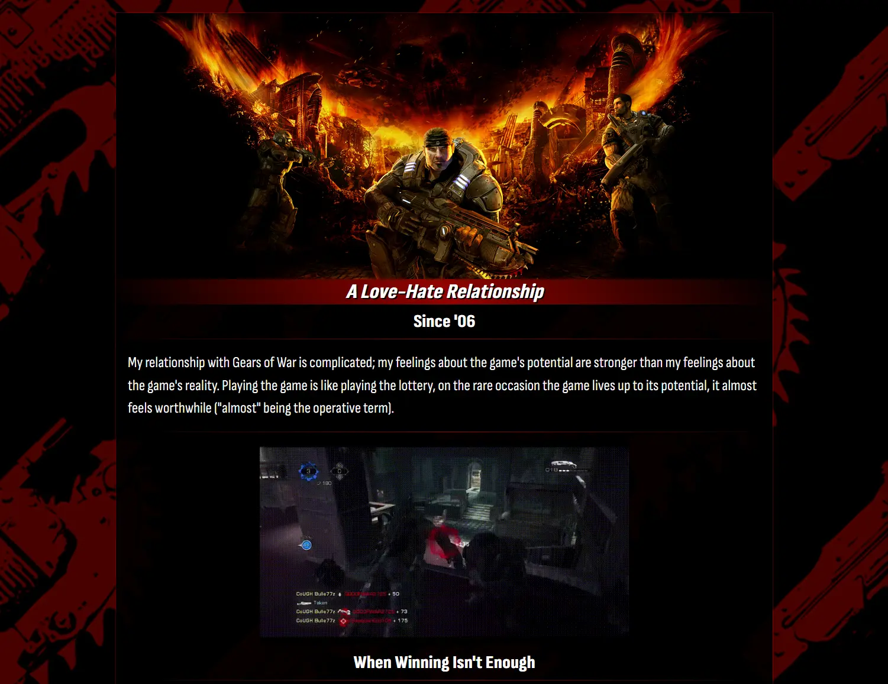

# html-me-something

[Visit the webpage](https://theodoremoreland.github.io/html-me-something/)

## Table of contents

- [Overview](#overview)
- [Screenshots](#screenshots)
  - [Desktop](#desktop)
  - [Mobile](#mobile)

## Overview

This was the first webpage I ever created. It was created for a homework assignment at LaunchCode's _Lc101_ (2018). The assignment required the use of some basic HTML and CSS to create a webpage based on a theme of our choice. I chose to base my webpage on my feelings on Gears of War, a video game franchise I was very passionate about. Since 2018, I have made minor updates to the page's design and wording. _My feelings on the franchise, however - remain the same._

Screenshots of the webpage can be found below.

_This was for a homework assignment at LaunchCode's Lc101 (2018)._

## Screenshots

### Desktop

#### Top of page

#### Middle of page

#### Bottom of page

### Mobile

#### Top of page

#### Scrolled down 1

#### Scrolled down 2

#### Scrolled down 3

#### Scrolled down 4

#### Bottom of page

