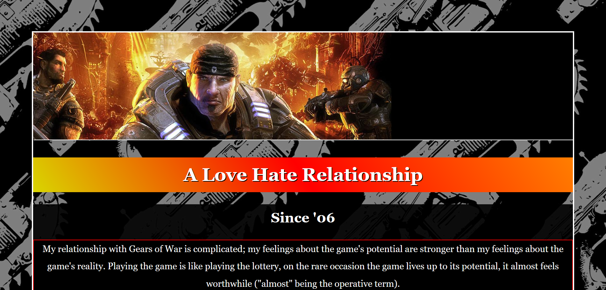
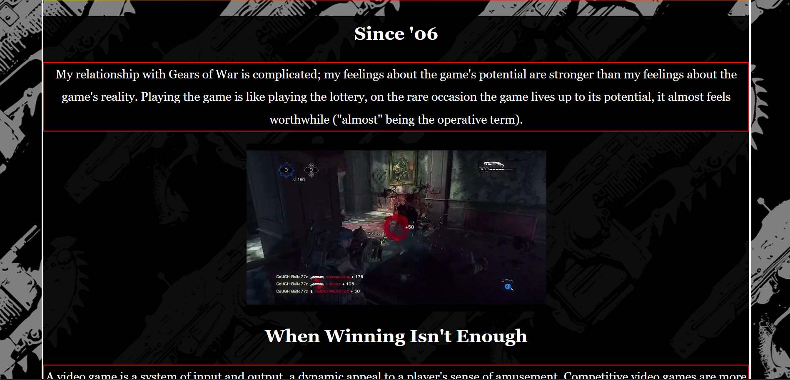
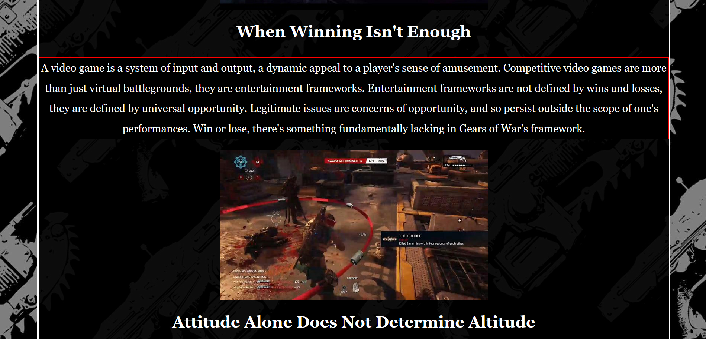
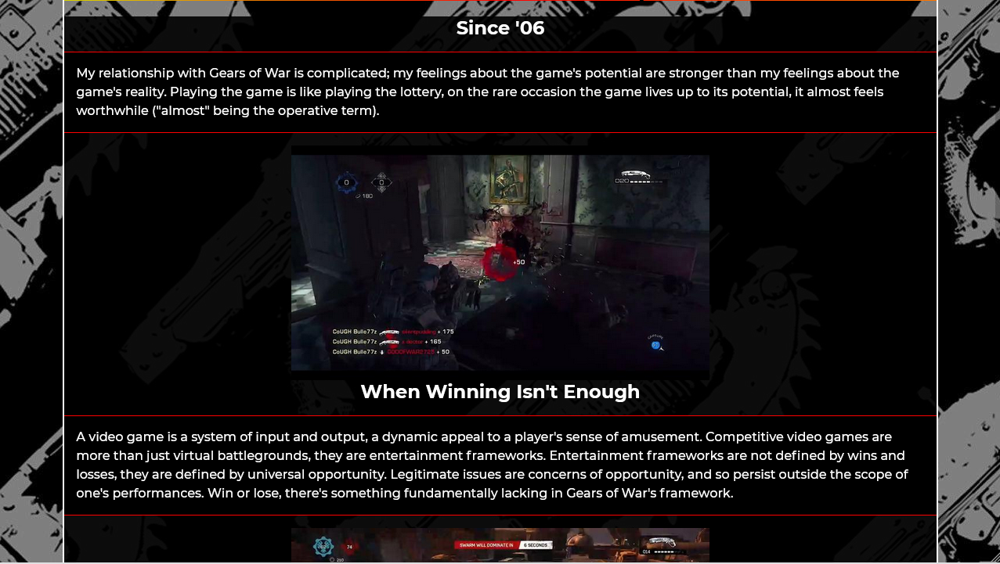
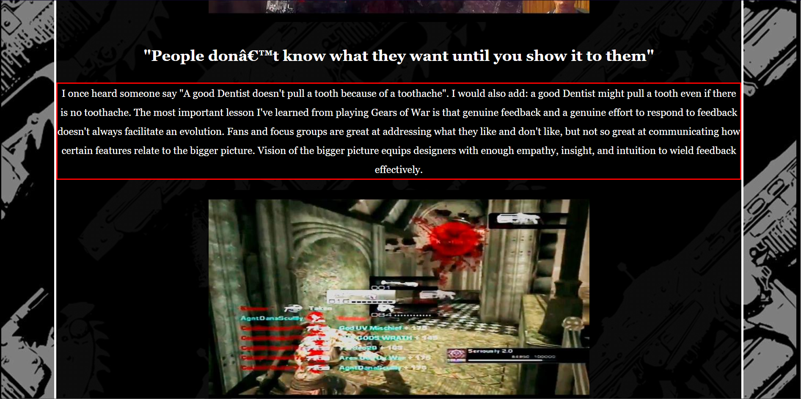
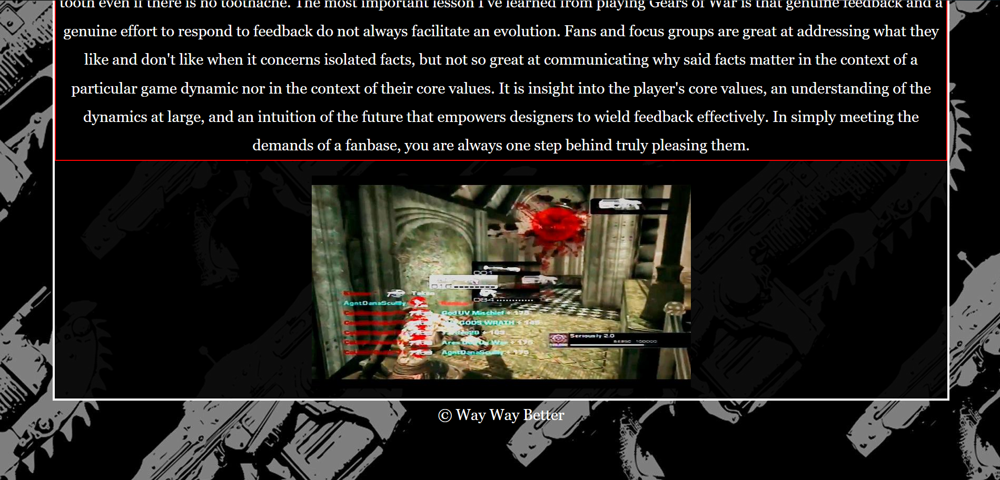
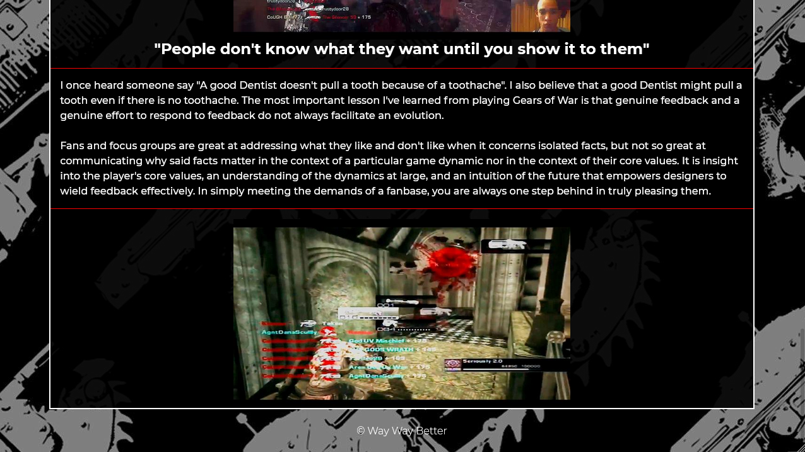

# html-me-something

This was my very first webpage. It was created in 2018 for a homework assignment that required some basic
usage of HTML and CSS. I have updated the page a few times since its creation such as making the page resposnive, correcting errors, refactoring, and deploying.

Screenshots of the webpage can be found below, but you can also get the full experience by visiting the webpage @ 
https://theodoremoreland.github.io/html-me-something/

*This was for a homework assignment at LaunchCode's Lc101 (2018).*

### Default view (mobile)

### Default view (Tablet)

### Default view (Desktop)

### Desktop view 2

### Desktop view 3

### Desktop view 4

### Desktop view 5

