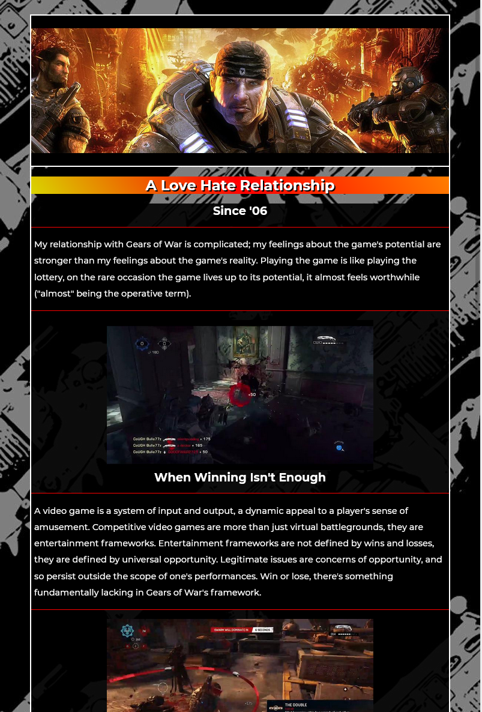

# html-me-something

This was the first webpage I ever created. It was created for a homework assignment at LaunchCode's _Lc101_ (2018). The assignment required the use of some basic HTML and CSS based on a theme of our choice. I chose to base my webpage on my feelings on Gears of War, a video game I was very passionate about. Since 2018, I have made minor updates to the page's design and wording. _My feelings on the franchise, however - remain the same._

Screenshots of the webpage can be found below.

[Visit the webpage](https://theodoremoreland.github.io/html-me-something/)

_This was for a homework assignment at LaunchCode's Lc101 (2018)._

### Default view (mobile)

### Default view (Tablet)

### Default view (Desktop)

### Desktop view 2

### Desktop view 3

### Desktop view 4

### Desktop view 5

