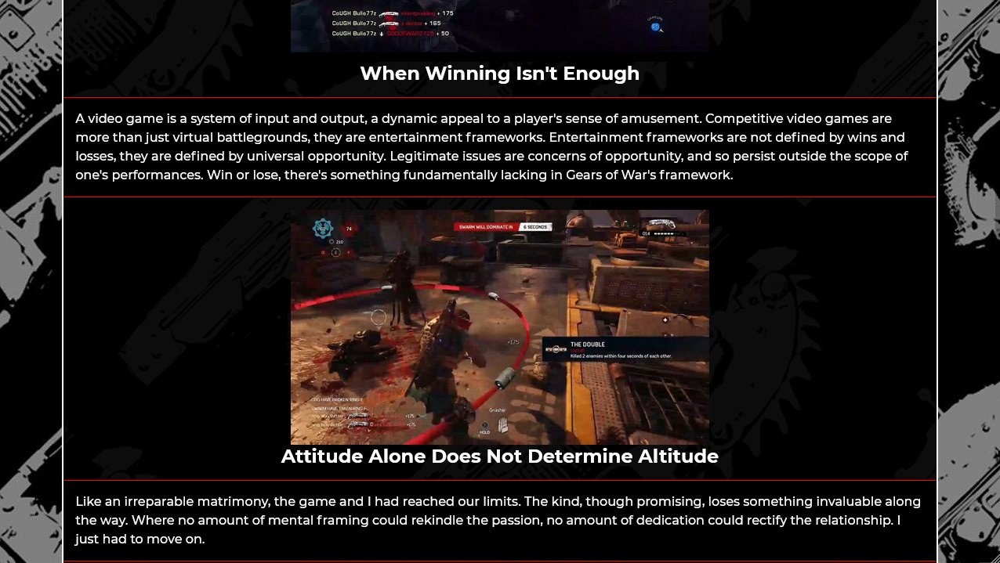
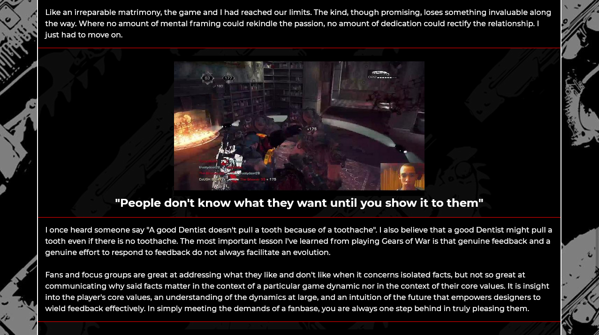

This was my very first webpage. It was created for a homework assignment that required some basic
usage of HTML and CSS. We had to write a few paragraphs, add some styling, and use select HTML elements such as "body","h1", etc and CSS selectors such as .{element}:hover. This webpage is special to me, not just because it was my first wepage during a time when I was first discovering my love for programming, but the webpage is also themed around one of my favorite video games during high school. I used actual screenshots of my own gameplay and the screenshots become animated GIFs once your mouse hovers over them.

Screenshots of the webpage can be found below, but you can also get the full experience by visiting the webpage @ 
https://deyewc102kav7.cloudfront.net/

*This was for a homework assignment at LaunchCode's Lc101 (2018).*

### Image 1

### Image 2

### Image 3

### Image 4

### Image 5

### Image 6

