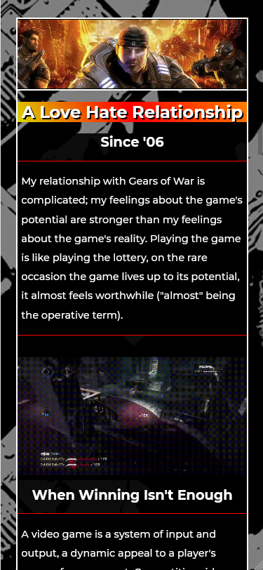
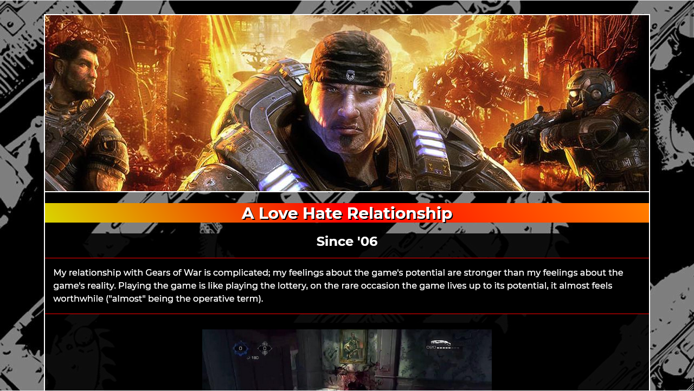

This was my very first webpage. It was created for a homework assignment that required some basic
usage of HTML and CSS. We had to write a few paragraphs, add some styling, and use select HTML elements and CSS selectors.
Screenshots of the webpage can be found below, but you can also get the full experience by visiting the webpage @ 
https://deyewc102kav7.cloudfront.net/

*This was for a homework assignment at LaunchCode's Lc101 (2018).*

